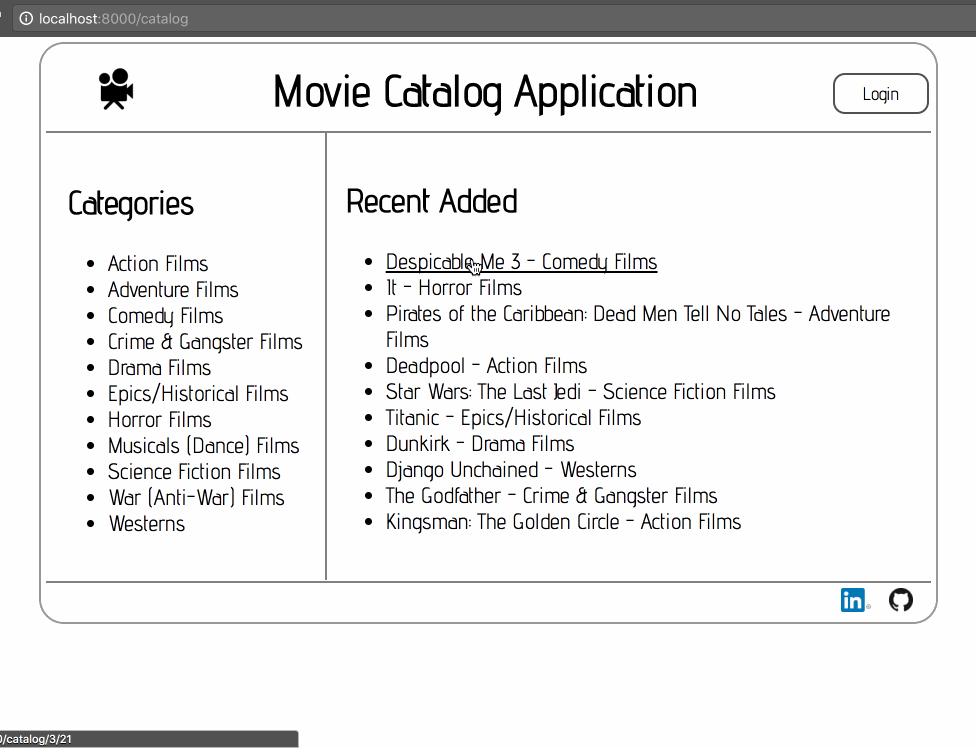
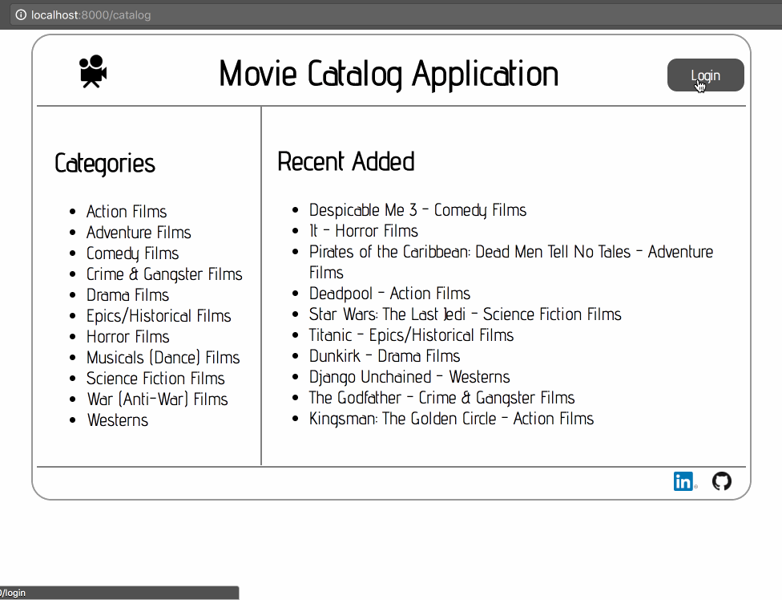
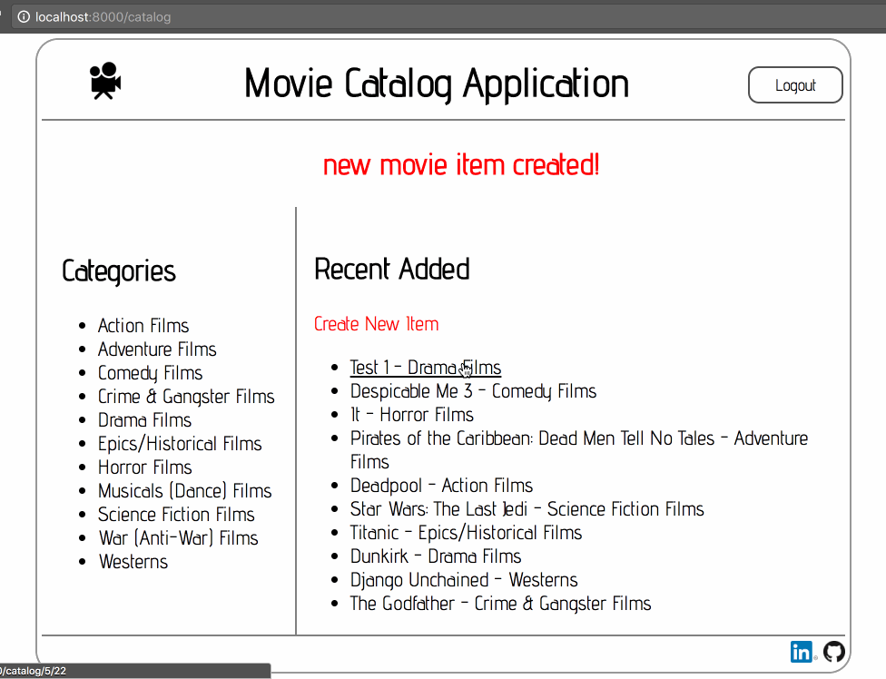
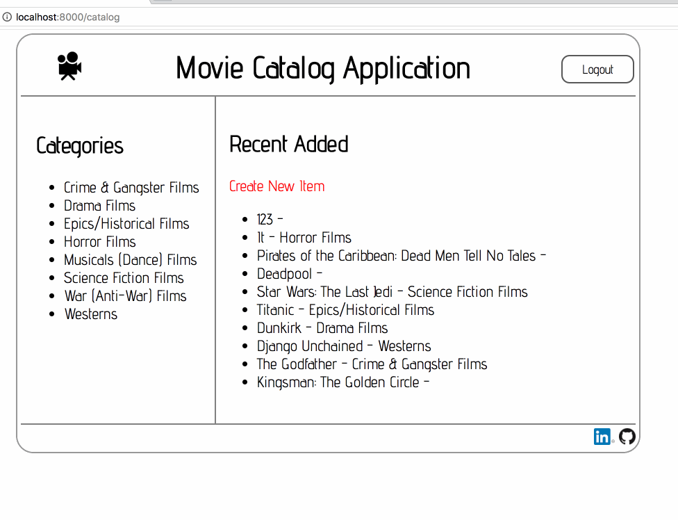

# Item-Catalog-Application
* This application  provides a list of items within a variety of categories as well as provide a user authentication system.  Users will have the ability to post, edit and delete their own items.
> [](Image)

### Installing

* Unzip the **VM configuration** and you will find a **vagrant** folder
* Use the **Terminal** to get into the **vagrant** folder from **VM configuration**
* run the following command
```sh
$ vagrant up
```
* This will cause Vagrant to download the Linux operating system and install it.
* After it finished and after the shell prompt comes back, you can run this command
```sh
$ vagrant ssh
```
* And this will let you login to the Linux VM. (Please do not shut down the terminal after the login)

### Setting up the enviroment
* Move the folder you downloaded from GitHub and put it into the vagrant folder
* use the following line to get into the vagrant VM folder
```sh
$ cd /vagrant
```
* Use the command line to get in to the folder you just downloaded
* Then you can run this command

then cd /catalog

then python database_setup.py
```sh
$ python lotsofitems.py
```
* After it added items succesfully, you can run the following command
```sh
$ python project.py
```
* After finish running project.py you can use your favorite browser to visit [this link](http://localhost:8000/)

### How to use
* You can browse through the website to find out the different categories of movies.
> [](Image)
* You can also create you own items after you login.
> [](Image)
* Only the users who created the item have the ability to post, edit, and delete it.
> [](Image)
* Once you log out. You can lost your right to change it.
> [](Image)
